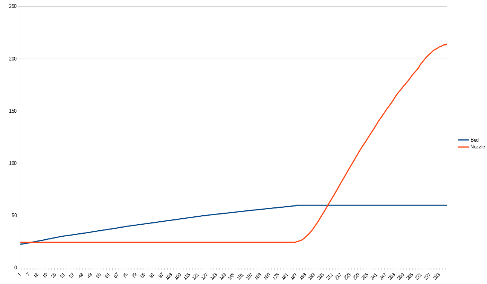
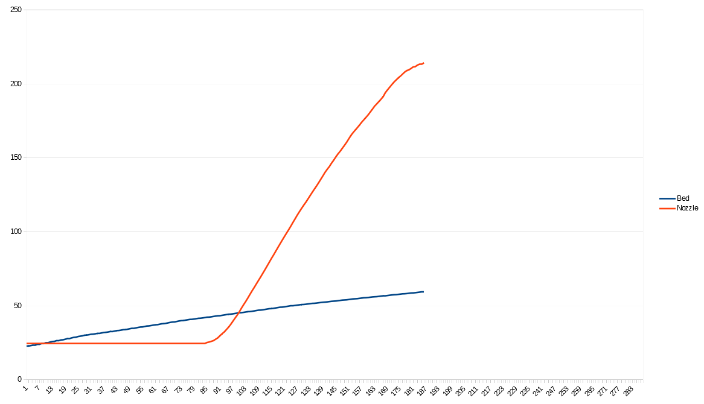

---
---

3D printer heat optimizer
=========================

Input settings
--------------

This form is a quick script for calculating a more optimal heating script than Cura's standard sequential procedure of heating bed, waiting, heating extruder and then waiting some more. It uses your temperature and timing settings to calculate a G-Code that parallelizes the heating of both elements, so they reach the target temperatures at the same time, reducing printing time.

### Nozzle

<dl>
	<dt><label for="nozzleinitial">Initial temperature</label></dt>
	<dd><input id="nozzleinitial" type="number" value="24.5" style="width: 5em;" step="0.5"> ºC (usually room temperature)</dd>
	<dt><label for="nozzletarget">Target temperature</label></dt>
	<dd><input id="nozzletarget" type="number" value="220" style="width: 5em;" step="1"> ºC</dd>
	<dt><label for="nozzletime">Time</label> (from initial to target)</dt>
	<dd><input id="nozzletime" type="time" value="00:02:00" step="1"></dd>
</dl>

### Bed

<dl>
	<dt><label for="bedinitial">Initial temperature</label></dt>
	<dd><input id="bedinitial" type="number" value="24.5" style="width: 5em;" step="0.5"> ºC (usually room temperature)</dd>
	<dt><label for="bedtarget">Target temperature</label></dt>
	<dd><input id="bedtarget" type="number" value="60" style="width: 5em;" step="1"> ºC</dd>
	<dt><label for="bedtime">Time</label> (from initial to target)</dt>
	<dd><input id="bedtime" type="time" value="00:03:00" step="1"></dd>
</dl>

Generated G-Code
----------------

<textarea id="generatedcode" style="font-family: monospace; width: 100%; max-width: 100%; height: 20em;">; Oops, is JS disabled?</textarea>

Foot notes
----------

Please note the generated G-Code will be room-temperature dependant. This should not be a concern with small temperature variations, such as those in a house or an office.

The bed in my case does follow a linear heating pattern, but the extruder seems to follow a slightly softer curve tgat seems to be caused by the heater having a reduced duty cycle when it reaches a point close to the target. I have decided not to take this into account for now, and assume a linear heating pattern for both elements. 

### Plots

Taken from the serial log of my Anet A8 (room 24.5ºC, bed heating time of 3:00 to 60ºC, extruder heating time of 1:50 to 215ºC)

#### Original Cura (sequential)

#### Improved (parallel)

