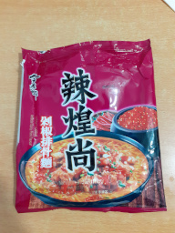
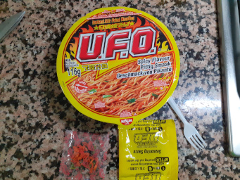
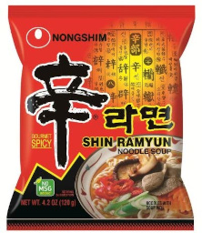

---
---

Noodles
=======

This is just a personal listing of noodles I've tried.

Don't expect this list to be fair - it's gonna be totally biased. Its sole purpose is for me to remember which ones I like, as I am retarded and I keep buying the same shit over and over again.

Good
----

The ones you'd stock by the thousands in case the factory stops making them.

**TODO**

Mediocre
--------

These are the ones you'd eat if you don't have anything better at hand.

**TODO**

Crap 
--------

Just don't even give these a second chance. They're just plain terrible and not worth your money.

### ★★☆☆☆ JML Spicy Pork

First of all, these noodles came with no kind of instructions for preparation in the localized label for the European market. After peeling it off, the actual package (in English and in Chinese) had no instructions either, so I was all on my own for figuring out what to do with the three different sachets. Zero customer care.

After looking a bit online, I settled on 500ml and 4 minutes at max heat, cooking the noodles, oil and flavour sachets at the same time, and adding the contents of the chili sachet later.

Now, about the results themselves: the noodles are okay-ish and taste good. Their texture is fine, and they're not too thick, nor too thin.

The soup, however, is just plain awful. It has _absolutely no resemblance at all_ to pork, by any stretch. All it tastes to is bitterness, a flavour I'm really not a fan of, and slightly spiciness. That's it.

After trying a couple sips from the soup, it just all went to trash and prepared the Nissin U.F.O. noodles from below (which, spoiler, ended up in the same place). It's not worth eating five hundred kilocalories of pure lad with a disgusting taste.

Also of note is that altough labeled JML, according to the original labelling they seem to be made by the Chinese Nissin factory, which isn't really known for their high quality products. I'll try to stay away from now on from JML-labeled products.

### ★★☆☆☆ Nissin U.F.O. Spicy Flavour

This Yakisoba bowl is made by Nissin, and has a pretty eye-catching design with pretty detailed instructions in both English and Dutch (?), so it's clearly made for the international market.

The bowl is rather interesting: it has two different openings, one for pouring in the water (about 500ml for three minutes), and another opening in the opposite side for draining the water after they're cooked which has a small filter for keeping the noodles and vegetables inside.

As usual with Nissin, the noodles are fine. They're thinner however than normal Nissin instant noodles with soup, but the taste is however the same and I like them.

After pouring the flavour sachet however, the overall taste doesn't change significantly. I'm not sure if whoever designed this crap forgot some ingredients or what, but the sachet gives _zero_ flavour to the noodles. It only adds a slightly darker color, and spicyness.

I didn't finish them either, and ended up in the trash. After these I gave up for trying new stuff and ended up just eating some random pre-made food I had lying in the fridge.

### ★☆☆☆☆ Nongshim Shin Ramyun

Holy shit this one. When I thought stuff couldn't get any worse, I decide to byt this steaming piece of toxic radioactive material.

The look was _fine_, but _that was it_. Not only I couldn't finish them, as the taste was totally missing and the noodles were floating in a sea of half a liter of water - this junk was **waaay too spicy**. I've eaten plenty of spicy stuff, even by Indian standards, but holy fuck, this literally made my stomach ache and throw up.

Fuck this, won't be buying _anything_ from this brand ever again.
