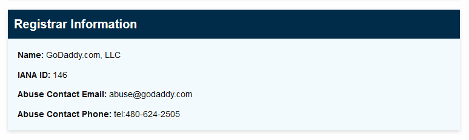
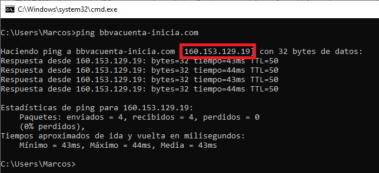
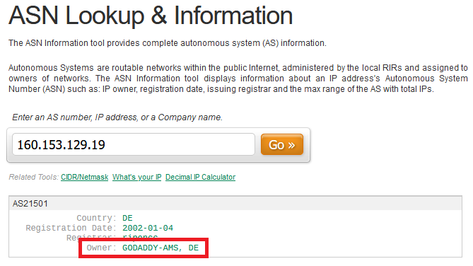
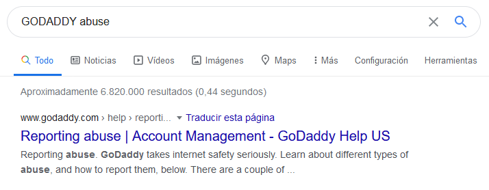

---
---

Reporting domains
=================

[← Back to main project page](index.html)

This is a quick document explaining what I do, and what you can do if you find in the wild an unblocked domain:

Is it really phishing?
----------------------

Many companies use a myriad of domains, with absurdly long names specially for advertisement purposes. So you probably want to make sure first it is really a phishing domain.

This is more of an art rather than a exact science, but usual telltale indicators are:

   - The page is served over HTTP instead of HTTPS.
   - Typing in fake account data still succeeds.
   - It requests for information they never should, like credit card details which the frigging bank themselves has issued.
   - The URL redirects to another unrelated domain, which is a blog or some foreign unrelated store.
   - The path contains bits in a language different than English and to the language used by the company. For instance, Spanish or English would be okay for an Spanish company, but not French or Germany.

Adding to NOMS
--------------

You can send me a pull request on my [GitHub repository](https://github.com/socram8888/not-on-my-shift), or if you aren't technically skilled, [contact me](/#contact) with details. This is the fastest but also the one that will reach the fewer amount of people.

Safe Browsing
-------------

Next you'll want to **report it to Google Safe Browsing**. This malware and phishing list is used by all mainstream browsers such as Mozilla Firefox and Google Chrome (and probably also Microsoft Edge, or are they still using their own like with IE? Dunno).

This is pretty easy:

  * If reporting malware, go to [Safe Browsing malware reporting page](https://safebrowsing.google.com/safebrowsing/report_badware/).
  * If reporting phishing, go to [Safe Browsing phishing reporting page](https://safebrowsing.google.com/safebrowsing/report_phish/).

You just need to type in the address you found, pass the reCAPTCHA check, optionally type in a short description (ie "this is a phishing site for X bank") and hit submit.

INCIBE
------

If you are based in Spain, consider also **dropping an email to [INCIBE](https://www.incibe.es/)**, the national cypersecurity agency.

Their email is [incidencias@incibe-cert.es](mailto:incidencias@incibe-cert.es), and you just need to type on a brief description of what you found, where, and the address of the phishing or malware site.

I am not sure if this actually does anything, but I tend to do it in case this speeds up the Google Safe Browsing report processing.

Domain registrar
----------------

You can also **contact the domain registrar**, aka the company the fuckers behind the phishing site used to register the domain.

For figuring that out, you can go to [ICANN Lookup](https://lookup.icann.org/) website, type in the domain name and you should see the "Abuse Contact Email" all registrars *must* publicly display and read, as per the ICANN rules.

You can just drop them a short email like the following:

> Hello,
>
> I have received an email with the domain fake-contoso.com, which hosts a phishing website for Contoso company, whose real website is aaazzz.com, and targets Spanish citizens to gather user credentials. This is illegal and should be removed.
>
> Best regards

Hosting provider
----------------

Finally, you might also want to **contact the hosting provider**. This is slightly harder than all of the above and depends on the hosting company they are using.

1. Figure out the IP where the phishing website is hosted. You can use ping in the command line, which will resolve the domain and report its IP.
  
   

2. Use a ASN lookup page like [neustar's](https://www.ultratools.com/tools/asnInfo) or [Hacker Target](https://hackertarget.com/as-ip-lookup/). Type in the IP address and it will spit out the company owning that IP.
  
   
  
   Of course, if the hosting provider is the same as the registrar, there's really no point in reporting to them again.

3. Finally, lookup in your favorite search engine `[company name] abuse`, and you should get a form or email where to report this case.

   

4. Send them an email or form like the one for reporting to the domain registrar.

[← Back to main project page](index.html)
