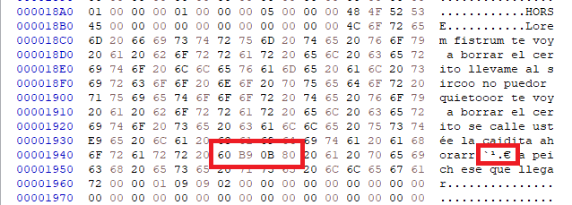
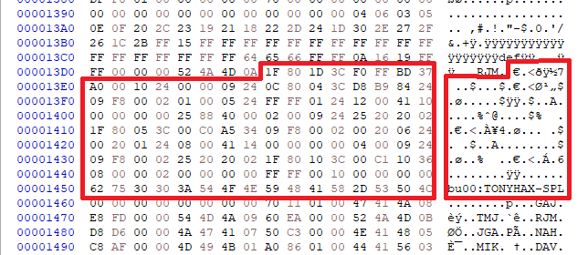
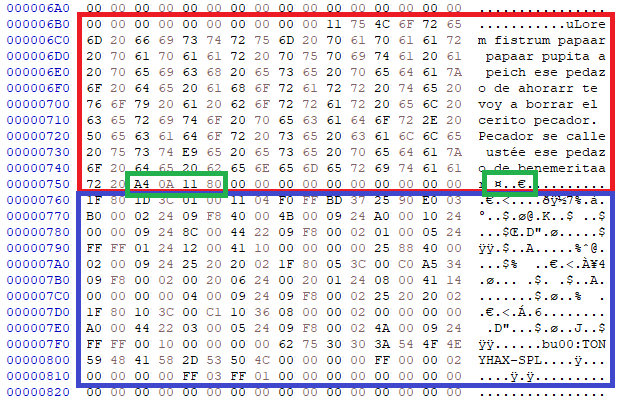

---
---

tonyhax
=======

Software backup loader exploit thing for the Sony PlayStation 1.

<iframe width="560" height="315" src="https://www.youtube.com/embed/TO6msoWZa2I" frameborder="0" allow="accelerometer; autoplay; clipboard-write; encrypted-media; gyroscope; picture-in-picture" allowfullscreen class="yt-video"></iframe>

Why?
----

The first question that might pop up on your mind regarding this project is "why the fuck didn't you just install a modchip?".

The answer is simple: I didn't want to mod my mint, boxed PSone, but I didn't want to leave it rotting on a shelf either.

Also, as an owner of a SCPH-102 console, these are a pain in the ass when it comes to chipping - in addition to the generic SCEx wobble check performed by the CD controller that is easily patchable, the boot menu on these also checks for the region string, which involve installing even more wires and a full sized Arduino Pro Mini or AtMega328 chip to patch the CPU BIOS to play out of region games. Not cool.

On top of that, and unlike Action Replay or swap discs, this does **allow CD-DA games and multi-disc games to work flawlessly**.

Download
--------

Releases are available at the [GitHub releases page](https://github.com/socram8888/tonyhax/releases).

Source code is also fully available under the [WTFPL license](https://github.com/socram8888/tonyhax/blob/master/LICENSE) at [GitHub](https://github.com/socram8888/tonyhax/).

Installation
------------

To install this exploit, you'd need a means of copying the required save files to a PS1 memory card. For this at the moment you have essentially two options:

  * Used another modded console, such as a PS2 with [Free McBoot](https://www.ps2-home.com/forum/viewtopic.php?t=1248) and uLaunchELF, to copy the save files to the memory card. For this, you'd need to **use the raw save files**, making sure **you do not rename them**.

  * Use a PC-based memory card editor, such as:
      * The official Memory Card Adapter for PS3 (product code CECHZM1J) and [OrionSoft's PS1 Memory Card Manager](http://onorisoft.free.fr/retro.htm?psx/psx.htm).
	  * A [DexDrive](https://en.wikipedia.org/wiki/DexDrive).

    For this purpose, I recommend using the MCS files, since those are easier to import and won't require manual configuration of the filename, region, etc...

All you have to do is copy the game's crafted save file and the tonyhax SPL file into the card. That's it.

Once installed, you can freely copy it to other cards using the PS1 and the memory card management menu, and distribute it freely amongst friends.

**Please note the save games expect the `BESLEM-99999TONYHAX` file to be in the first memory card slot. It will not work if the memory card is inserted in the second card slot.**

Video from [MrMario2011](https://www.youtube.com/channel/UC-YlkP3c1zKUPfyMMurARAQ) installing it using uLaunchELF on a memory card:

<iframe width="560" height="315" src="https://www.youtube.com/embed/caBo0YARS0c?start=1083" frameborder="0" allow="accelerometer; autoplay; clipboard-write; encrypted-media; gyroscope; picture-in-picture" allowfullscreen class="yt-video"></iframe>

### Save games

| Game                            | Region | Code       | MCS file          | Raw file             |
|---------------------------------|--------|------------|-------------------|----------------------|
| tonyhax SPL **required**        | -      | -          | tonyhax.mcs       | BESLEM-99999TONYHAX  |
| Brunswick Circuit Pro Bowling   | NTSC-U | SLUS-00571 | brunswick1-us.mcs | BASLUS-00571         |
| Brunswick Circuit Pro Bowling   | PAL-E  | SLES-01376 | brunswick1-eu.mcs | BESLES-01376         |
| Brunswick Circuit Pro Bowling 2 | NTSC-U | SLUS-00856 | brunswick2-us.mcs | BASLUS-00856         |
| Brunswick Circuit Pro Bowling 2 | PAL-E  | SLES-02618 | brunswick2-eu.mcs | BESLES-02618         |
| Tony Hawk's Pro Skater 2        | NTSC-U | SLUS-01066 | thps2-us.mcs      | BASLUS-01066TNHXG01  |
| Tony Hawk's Pro Skater 2        | PAL-E  | SLES-02908 | thps2-eu.mcs      | BESLES-02908TNHXG01  |
| Tony Hawk's Pro Skater 2        | PAL-DE | SLES-02910 | thps2-de.mcs      | BESLES-02910TNHXG01  |
| Tony Hawk's Pro Skater 2        | PAL-FR | SLES-02909 | thps2-fr.mcs      | BESLES-02909TNHXG01  |
| Tony Hawk's Pro Skater 3        | NTSC-U | SLUS-01419 | thps3-us.mcs      | BASLUS-01419TNHXG01  |
| Tony Hawk's Pro Skater 3        | PAL-E  | SLES-03645 | thps3-eu.mcs      | BESLES-03645TNHXG01  |
| Tony Hawk's Pro Skater 3        | PAL-DE | SLES-03647 | thps3-de.mcs      | BESLES-03647TNHXG01  |
| Tony Hawk's Pro Skater 3        | PAL-FR | SLES-03646 | thps3-fr.mcs      | BESLES-03646TNHXG01  |
| Tony Hawk's Pro Skater 4        | NTSC-U | SLUS-01485 | thps4-us.mcs      | BASLUS-01485TNHXG01  |
| Tony Hawk's Pro Skater 4        | PAL-E  | SLES-03954 | thps4-eu.mcs      | BESLES-03954TNHXG01  |
| Tony Hawk's Pro Skater 4        | PAL-DE | SLES-03955 | thps4-de.mcs      | BESLES-03955TNHXG01  |
| Tony Hawk's Pro Skater 4        | PAL-FR | SLES-03956 | thps4-fr.mcs      | BESLES-03956TNHXG01  |

### In upcoming v1.2

| Game                            | Region | Code       | MCS file          | Raw file             |
|---------------------------------|--------|------------|-------------------|----------------------|
| Cool Boarders 4                 | NTSC-U | SCUS-94559 | coolbrd4-us.mcs   | BASCUS-9455916       |
| Cool Boarders 4                 | PAL-E  | SCES-02283 | coolbrd4-eu.mcs   | BESCES-0228316       |
| Crash Bandicoot 2               | NTSC-U | SCUS-94154 | crash2-us.mcs     | BASCUS-9415400047975 |
| Crash Bandicoot 2               | PAL-E  | SCES-00967 | crash2-eu.mcs     | BESCES-0096700765150 |
| Crash Bandicoot 3               | NTSC-U | SCUS-94244 | crash3-us.mcs     | BASCUS-9424400000000 |
| Crash Bandicoot 3               | PAL-E  | SCES-01420 | crash3-eu.mcs     | BESCES-0142000000000 |
| Sports Superbike                | PAL-E  | SLES-03057 | superbike1-eu.mcs | BESLES-03057SSBv1    |
| Sports Superbike 2              | PAL-E  | SLES-03827 | superbike2-eu.mcs | BESLES-03827SSII     |
| XS Moto                         | NTSC-U | SLUS-01506 | xsmoto-us.mcs     | BASLUS-01506XSMOTOv1 |
| XS Moto                         | PAL-E  | SLES-04095 | xsmoto-eu.mcs     | BESLES-04095XSMOTO   |

Usage
-----

### For Cool Boarders 4

Will be supported in v1.2.

1. Boot the game. It should say the records and settings have been automatically loaded.
2. Click on "ONE PLAYER".

The exploit should then launch.

### For Crash Bandicoots

Will be supported in v1.2.

1. Boot the game.
2. On the title menu, choose LOAD GAME.
3. On the save game list, select "TONYHAX" and press X.

The exploit should then launch.

### For Brunswick games

Supported since v1.1.

1. Boot the game as you'd normally do.
2. On the main menu, select "LOAD GAME".
3. Select "MEMORY CARD 1".

After about three seconds tonyhax should be running.

### For Sports Superbike 1

1. On the language selection screen, if prompted to, select the English language.
2. Enter the Memory Card menu.
3. Load game from the Memory Card. Click accept after it's done loading.
4. On the main menu, select "Race".
5. Click on "Single race".

The exploit should then launch.

### For Sports Superbike 2 and XS Moto

1. If you are using the European version, on the language selection screen select the English language.
2. On the main menu, choose Options.
3. Select Load game and choose the memory card where the save is stored.
4. Back on the main menu, click on either "Single Race" or "Championship".

The exploit should then run.

### For Tonyhawk's games

1. Boot the game as you'd normally do.
2. On the main menu, wait until the save file is automatically loaded (it should say "Loading TONYHAX EU/US/DE/FR", depending on the game's region).
3. After it's done, choose the "CREATE SKATER" menu and press X.

After a couple seconds, tonyhax should boot.

### For all

During the exploit launch, since v1.1.2 the screen will flash with different colors depending on which phase it is:

 * <span class="color-block" style="background-color: #f0f;"></span> **Purple**: the memory cards are being reinitialized. This only happens on Brunswick games, since THPS don't require it.
 * <span class="color-block" style="background-color: #00f;"></span> **Blue**: the SPL is being loaded from the memory card into main memory.
 * <span class="color-block" style="background-color: #0f0;"></span> **Green**: the SPL is done loading and will execute immediately. The SPL immediately reinitializes the screen so this color should be barely visible.
 * <span class="color-block" style="background-color: #f00;"></span> **Red**: indicates that a fatal error occured loading the SPL. For example: the file isn't on the first memory card, the filename isn't correct or some other reason.

The console should spend no more than a couple seconds with each color. If it spends more time (specially with the green screen), it's probably crashed. Please report it.

Compatibility
-------------

### Consoles

After receiving multiple reports testing on different consoles, it seems that tonyhax works with:

 * Every PAL PlayStation 1 console.
 * Every NTSC-U PlayStation 1 console **except** the very early SCPH-1000.
 * Every PAL and NTSC-U PlayStation 2 with model number SCPH-39xxx or lower.
 * NetYaroze consoles.

However, this will **not** work with:

 * Japanese NTSC-J consoles (stubbed/bugged CD unlock).
 * NTSC-U PlayStation 1 SCPH-1000 consoles (BIOS predates the introduction of the CD unlock command).
 * PlayStation 2 consoles with model number SCPH-50000 or newer (this revision replaced the disc controller and got the backdoor removed).

These consoles might be able to boot the exploit, but the CD patch that allows booting from burned media will not work.

### Incompatible games

This is a short, non-exhaustive list of games that have been report not to work:

 * No games have been reported to fail on v1.1.

How does this work?
--------------------

In layman terms, this exploit uses an oversight from the programmers: the game does not check that text in the save file hasn't been tampered and fits in the space the program allocated for it. If we externally change that text to something longer, we can overwrite other vital parts of the system's memory and run our own code.

### For Tonyhawk's games

THPSx save games have been modified to have the following two separate parts:

 - The highscores have been replaced with a small first-stage payload of a couple hundred bytes.
 - The first custom character name has an abnormally long name, which contains at an specific position the memory address of the first-stage payload.



When entering the skater customization menu, the menu is dinamically generated to include the saved skater names in a way like:

```c
void trim_string(char * buffer, int len) {
	char trimmed[x];

	// Copy to our local buffer
	strcpy(trimmed, buffer);

	// Trim it
	trimmed[len - 4] = '.';
	trimmed[len - 3] = '.';
	trimmed[len - 2] = '.';
	trimmed[len - 1] = 0;

	// Copy back to the original buffer
	strcpy(buffer, trimmed);
}

void create_skater_entry(int id) {
	char menutext[x];
	int textlen;

	sprintf(menutext, "Skater %c: %s", 'A' + id, custom_skater_data[id].name);
	while ((textlen = strlen(menutext)) > MAX_LEN) {
		trim_string(menutext, textlen);
	}

	// ...
}
```

Essentially, if a string that's too long to overflow the buffer is specified, the buffer overflows and overwrites part of the stack as we want to, but then it gets hammered with periods.

**However**, as `trim_string` is a a subcall and has a local buffer, if we specify a character name with the right length (165 characters, exactly), the null terminator in the `trimmed` buffer overlaps the first character of `menutext`, resulting in a menu entry with length of 0, thus sparing the rest of the stack contents.

After some more menu-related stuff, the return address is finally pulled from the stack and the code jumps to it. This return address points to the beginning of the high scores menu, whose contents are also loaded with no checks from the memory card, and where we have the first-stage payload.



### For Brunswick games

This is a super simple exploit. The program loads the entire save file contents at an static memory location, then blindly `sprintf`s into a stack buffer. Using a string long enough with the address of first stage loader at the correct position gets us executing our own code.



Above, the <span style="color: red;">long username</span>, with the <span style="color: green;">memory location</span> (`0x80110AA4`) of the <span style="color: blue;">first stage bootloader</span>.

### Common to all

The first stage payload's sole purpose is to load the secondary program loader (or SPL for short) from an additional save file in the memory card using the PS1 BIOS calls. Once loaded, it jumps straight to it. If for some reason it fails to load the SPL, a red screen is displayed, indicating that the exploit was successfully triggered but the it couldn't continue.

As the console is left in an inconsistent state, the SPL then first reinitializes the system kernel (RAM, devices...), by using the very same calls the ROM executes during the booting of the console.

After that, the GPU is reset. Once the GPU is ready again, the sets up the video to a resolution of 320x240, unpacks the 1bpp font from the BIOS ROM into VRAM, and draws the basic border and program name to know everything is working fine until this point.

With a fully working screen, it then proceeds to unlocks the CD drive to accept discs missing the SCEx signature, leveraging the [CD BIOS unlock commands](https://problemkaputt.de/psx-spx.htm#cdromsecretunlockcommands) found by Martin Korth. These unlock commands are a sort of backdoor, and the drive, probably in order to keep them secret, returns an error instead of a success message. The SPL is coded to expect a particular error to be returned, and will actually abort if the drive returns that it succeeded or if it returns another unexpected error code.

After unlocking it, it waits for the lid to be opened and closed, allowing the user to insert a new CD.

After that, the CD filesystem is reinitialized. It proceeds to read the SYSTEM.CNF configuration file, reinitializes the kernel with the parameters the game needs, and finally loads and runs the game's main executable.

Pending games
-------------

This is just a list of games that have been suggested to be checked but I've still not had time to look at them.

 * Cart World Series: has character naming. Suggested by [Filiberto](https://www.youtube.com/channel/UCdg5yHFdCLMCunRHMVAJ1aA) on a YouTube comment.
 * Castrol Honda VTR: the original branded version of XS Moto. Should have the same exploit. Suggested by [@FMecha](https://twitter.com/FMecha_EXE/status/1372921230676783107) on Twitter.

Unexploitable games
-------------------

This is just a short list of games I've glanced over and determined they are unlikely to be exploitable:

 * Breath of Fire III: every text field is fixed length.
 * Driver 2: tested by Patrick Vogt. Causes the same graphical issues than on Hogs of War, but nothing exploitable.
 * Hogs of War: has names that when overwritten just cause graphical issues in the team edition menu, but that's about it.
 * International Socer Pro '98: text is packed and the payload would have to use only the lowest 7 bits of a byte. Aside from this, everything seems to be copied using strncpy. Interestingly, using an ASCII control character seems to cause the game to go nuts and it starts self-destructing the RAM endlessly.
 * Mat Hoffmans Pro BMX: uses the same engine as THPS, but there is no place where user can introduce text.
 * Micro Machines V3: the game uses the save text as the user's name, extracting it from between the parentheses. Removing these parentheses or spacing them beyond what the game expects causes a good part of RAM to be overwritten with '?', which isn't really useful.
 * Spiderman: has text but increasing their length just causes graphical issues. Savefiles have checksums too.

Acknowledgements
----------------

In alphabetical order:

 * [ChampionLeake](https://twitter.com/ChampionLeake79) for documenting the Brunswick exploits at [PlayStation dev wiki](https://playstationdev.wiki/ps1devwiki/index.php?title=Vulnerabilities).
 * [Gerardo Rodriguez](https://www.youtube.com/channel/UCxus_GF6-Lu9qD62nhLYxtA) for suggesting Cool Boarders 4 on a YouTube comment.
 * [Jose Silva](https://github.com/krystalgamer) for adding support for Sports Superbike II and XS Moto.
 * Martin Korth for his [super awesome technical documentation page](https://problemkaputt.de/psx-spx.htm) that was vital for the development of this project, as well as for developing the [no$psx emulator](https://problemkaputt.de/psx.htm) that was also essential for debugging.
 * [Patrick Vogt](https://patrickvogt.net/) for testing on multiple development PS1 consoles.

On the media
------------

Sorted from older to newer.

 * [GBAtemp - Tonyhax is a new softmod backup loader for the PlayStation 1](https://gbatemp.net/threads/tonyhax-is-a-new-softmod-backup-loader-for-the-playstation-1.584717/)
 * [psx-place - PS1 tonyhax - A Software backup loader exploit for the PS1 (leverages save game exploit)](https://www.psx-place.com/threads/tonyhax-a-software-backup-loader-exploit-for-the-ps1-leverages-save-game-exploit.33236/)
 * [MrMario2011 - PS4 7.50 Jailbreak Released & tonyhax PS1 Softmod Backup Loader - ModChat 075](https://www.youtube.com/watch?v=caBo0YARS0c)
 * [ModzvilleUSA - TONYHAX Setup Guide! - New Softmod for every Ps1 console!](https://www.youtube.com/watch?v=gtba3GtmC1I)
 * [Hackaday - PlayStation Unlocked With New Software Hack](https://hackaday.com/2021/03/15/playstation-unlocked-with-new-software-hack/)
