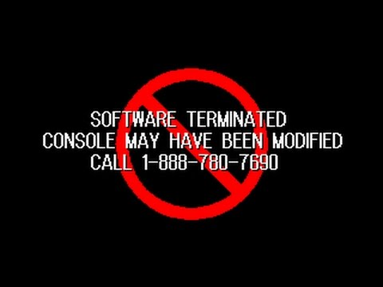

---
---

tonyhax
=======

Software backup loader exploit thing for the Sony PlayStation 1.

<iframe width="560" height="315" src="https://www.youtube.com/embed/TO6msoWZa2I" frameborder="0" allow="accelerometer; autoplay; clipboard-write; encrypted-media; gyroscope; picture-in-picture" allowfullscreen class="yt-video"></iframe>

Why?
----

The first question that might pop up on your mind regarding this project is "why the fuck didn't you just install a modchip?".

The answer is simple: I didn't want to mod my mint, boxed PSone, but I didn't want to leave it rotting on a shelf either.

Also, as an owner of a SCPH-102 console, these are a pain in the ass when it comes to chipping - in addition to the generic SCEx wobble check performed by the CD controller that is easily patchable, the boot menu on these also checks for the region string, which involve installing even more wires and a full sized Arduino Pro Mini or AtMega328 chip to patch the CPU BIOS to play out of region games. Not cool.

On top of that, and unlike Action Replay or swap discs, this does **allow CD-DA games and multi-disc games to work flawlessly**.

Download
--------

Releases are available at the [GitHub releases page](https://github.com/socram8888/tonyhax/releases).

Source code is also fully available under the [WTFPL license](https://github.com/socram8888/tonyhax/blob/master/LICENSE) at [GitHub](https://github.com/socram8888/tonyhax/).

Installation
------------

As of tonyhax v1.4, you have two options:
 * [Launch using a game exploit](game-exploit.html)
 * [Launch using FreePSXBoot](freepsxboot.html)
 * [Launch using the boot CD](boot-cd.html)

| Method                                 | Game exploit          | FreePSXBoot           | Boot CD               |
|----------------------------------------|-----------------------|-----------------------|-----------------------|
| Needs an original game?                | Yes                   | No                    | No                    |
| Needs an chipped console?              | No                    | No                    | Yes                   |
| Needs a memory card?                   | Yes                   | Yes                   | No                    |
| Can the memory card store other saves? | Yes                   | No                    | N/A                   |
| Time from off to playing a backup      | ~1m30s                | ~1m                   | ~1m                   |

Regarding compatibility:

| Method                                 | Game exploit          | FreePSXBoot           | Boot CD               |
|----------------------------------------|-----------------------|-----------------------|-----------------------|
| Compatible with European PS1?          | Yes                   | Yes                   | Yes                   |
| Compatible with American PS1?          | Yes                   | Yes                   | Yes                   |
| Compatible with Japanese PS1?          | No                    | No                    | No                    |
| Compatible with European PS2?          | ≤ SCPH-39000 only     | No                    | ≤ SCPH-39000 only     |
| Compatible with American PS2?          | ≤ SCPH-39000 only     | No                    | ≤ SCPH-39000 only     |
| Compatible with Japanese PS2?          | No                    | No                    | No                    |

Both behave identically the same feature-wise, so use whichever suits you more.

Game compatibility
------------------

First and foremost, the console **can only read CD-R media, not CD-RW discs**.

Despite the ability of tonyhax to patch games with antipiracy, only a very small subset of games are currently supported, since it's a pretty manual and laborious task. As a general rule, if the game can be copied in a manner that doesn't trigger antipiracy (for instance, by properly copying the subchannel data for games that are EDC- or libcrypt-protected), I will not look into patching them. If you want to do it yourself and make a PR, that's fine though.

If the game displays a message like the one above, this means the game has an explicit modchip check, and the only way to fix this would be to patch the game. In that case, [please file a report on GitHub](https://github.com/socram8888/tonyhax/issues/new?assignees=&labels=antipiracy&template=antipiracy-issue.md&title=).

### Games already supported

This is the list of all games for which tonyhax has an antipiracy/antimodchip patch, so they can be launched without having to patch them first:

| Game                                   | Region | Code       | Version | Notes                                    |
|----------------------------------------|--------|------------|---------|------------------------------------------|
| Aconcagua                              | NTSC-J | SCPS-10131 |         | Probably broken                          |
| Beatmania 6thMix + Core Remix          | NTSC-J | SLPM-87012 |         |                                          |
| Biohazard 3: Last Escape               | NTSC-J | SLPS-02300 | v1.0    |                                          |
| Biohazard 3: Last Escape               | NTSC-J | SLPS-02300 | v1.1    |                                          |
| Biohazard: Gun Survivor                | NTSC-J | SLPS-02553 |         |                                          |
| Dino Crisis                            | NTSC-J | SLPS-02180 |         |                                          |
| Dino Crisis                            | NTSC-U | SLUS-00922 | v1.1    |                                          |
| Legend of Dragoon (Disc 1)             | NTSC-U | SCUS-94491 |         |                                          |
| Legend of Dragoon (Disc 2)             | NTSC-U | SCUS-94584 |         |                                          |
| Legend of Dragoon (Disc 3)             | NTSC-U | SCUS-94585 |         |                                          |
| Legend of Dragoon (Disc 4)             | NTSC-U | SCUS-94586 |         |                                          |
| Legend of Dragoon (Disc 1)             | PAL-EN | SCES-03043 |         |                                          |
| Legend of Dragoon (Disc 2)             | PAL-EN | SCES-13043 |         |                                          |
| Legend of Dragoon (Disc 3)             | PAL-EN | SCES-23043 |         |                                          |
| Legend of Dragoon (Disc 4)             | PAL-EN | SCES-33043 |         |                                          |
| Legend of Dragoon (Disc 1)             | PAL-FR | SCES-03044 |         |                                          |
| Legend of Dragoon (Disc 2)             | PAL-FR | SCES-13044 |         |                                          |
| Legend of Dragoon (Disc 3)             | PAL-FR | SCES-23044 |         |                                          |
| Legend of Dragoon (Disc 4)             | PAL-FR | SCES-33044 |         |                                          |
| Legend of Dragoon (Disc 1)             | PAL-DE | SCES-03045 |         |                                          |
| Legend of Dragoon (Disc 2)             | PAL-DE | SCES-13045 |         |                                          |
| Legend of Dragoon (Disc 3)             | PAL-DE | SCES-23045 |         |                                          |
| Legend of Dragoon (Disc 4)             | PAL-DE | SCES-33045 |         |                                          |
| Legend of Dragoon (Disc 1)             | PAL-IT | SCES-03046 |         |                                          |
| Legend of Dragoon (Disc 2)             | PAL-IT | SCES-13046 |         |                                          |
| Legend of Dragoon (Disc 3)             | PAL-IT | SCES-23046 |         |                                          |
| Legend of Dragoon (Disc 4)             | PAL-IT | SCES-33046 |         |                                          |
| Legend of Dragoon (Disc 1)             | PAL-ES | SCES-03047 |         |                                          |
| Legend of Dragoon (Disc 2)             | PAL-ES | SCES-13047 |         |                                          |
| Legend of Dragoon (Disc 3)             | PAL-ES | SCES-23047 |         |                                          |
| Legend of Dragoon (Disc 4)             | PAL-ES | SCES-33047 |         |                                          |
| Ore No Ryouri                          | NTSC-J | SCPS-10099 |         |                                          |
| pop'n music 2                          | NTSC-J | SLPM-86294 |         |                                          |
| pop'n music 6                          | NTSC-J | SLPM-87089 |         |                                          |
| Resident Evil Survivor                 | NTSC-U | SLUS-01087 |         |                                          |
| Rockman 2 - Dr Wily No Kazo            | NTSC-J | SLPS-02255 |         |                                          |
| Rockman 3 - Dr Wily No Saigo           | NTSC-J | SLPS-02262 |         |                                          |
| Rockman X5                             | NTSC-J | SLPM-86666 |         |                                          |
| Seiken Densetsu                        | NTSC-J | SLPS-02170 |         |                                          |
| Tetris with Card Captor Sakura         | NTSC-J | SLPS-02886 |         |                                          |
| Tokimeki Memorial 2                    | NTSC-J | SLPM-86355 |         | Disc 1 only. Original edition.           |
| Tokimeki Memorial 2                    | NTSC-J | SLPM-86723 |         | Disc 1 only. KONAMI THE BEST edition.    |
| Tomba! 2 - The Evil Swine Return       | NTSC-U | SCUS-94454 |         |                                          |
| YuGiOh Forbidden Memories              | NTSC-U | SLUS-01411 |         |                                          |
| YuGiOh Forbidden Memories              | PAL-ES | SLES-03951 |         |                                          |

Acknowledgements
----------------

In alphabetical order:

 * [Alex Free](https://github.com/alex-free) for adding the boot CD image.
 * [ChampionLeake](https://twitter.com/ChampionLeake79) for documenting the Brunswick exploits at [PlayStation dev wiki](https://playstationdev.wiki/ps1devwiki/index.php?title=Vulnerabilities).
 * [Gerardo Rodriguez](https://www.youtube.com/channel/UCxus_GF6-Lu9qD62nhLYxtA) for suggesting Cool Boarders 4 on a YouTube comment.
 * [@FMecha](https://twitter.com/FMecha_EXE/status/1372921230676783107) for suggesting Castrol Honda VTR on Twitter.
 * [Jose Silva](https://github.com/krystalgamer) for adding support for Sports Superbike II and XS Moto.
 * Martin Korth for his [super awesome technical documentation page](https://problemkaputt.de/psx-spx.htm) that was vital for the development of this project, as well as for developing the [no$psx emulator](https://problemkaputt.de/psx.htm) that was also essential for debugging.
 * [Patrick Vogt](https://patrickvogt.net/) for testing on multiple development PS1 consoles.

Also thanks to everyone that's reported the issues on GitHub and helped me make it better!

On the media
------------

Sorted from older to newer.

 * [GBAtemp - Tonyhax is a new softmod backup loader for the PlayStation 1](https://gbatemp.net/threads/tonyhax-is-a-new-softmod-backup-loader-for-the-playstation-1.584717/)
 * [psx-place - PS1 tonyhax - A Software backup loader exploit for the PS1 (leverages save game exploit)](https://www.psx-place.com/threads/tonyhax-a-software-backup-loader-exploit-for-the-ps1-leverages-save-game-exploit.33236/)
 * [MrMario2011 - PS4 7.50 Jailbreak Released & tonyhax PS1 Softmod Backup Loader - ModChat 075](https://www.youtube.com/watch?v=caBo0YARS0c)
 * [ModzvilleUSA - TONYHAX Setup Guide! - New Softmod for every Ps1 console!](https://www.youtube.com/watch?v=gtba3GtmC1I)
 * [Hackaday - PlayStation Unlocked With New Software Hack](https://hackaday.com/2021/03/15/playstation-unlocked-with-new-software-hack/)
 * [MrMario2011 - How to Softmod Your PS1 - tonyhax Install Tutorial](https://www.youtube.com/watch?v=01gVgTQLP9U)
