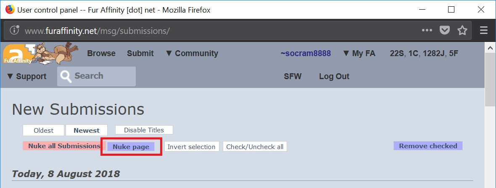

Userscripts
===========

This page contains a few userscripts I've made over the years to improve my navigation experience.

FurAffinity
-----------

All these scripts are made for [FurAffinity](https://www.furaffinity.net), a furry artwork website.

Beware all these scripts are **broken as of 2020/04/05** - I haven't got around updating them after the website theme change.

### Easier navigation

{: style="text-align: center;"}
[⬇️ CLICK HERE TO INSTALL ⬇️](fa-easy-nav.user.js)

Modifies the submission page so the next and previous images in current gallery can be opened by clicking on the left or right of the current, respectively.

### Nuke page

{: style="text-align: center;"}
[⬇️ CLICK HERE TO INSTALL ⬇️](fa-nuke-page.user.js)

This script adds a small "Nuke page" button to delete all images from a page in submissions.

Just because I didn't want to click "Invert selection" and "Remove selected". Yes I'm that lazy. Yes it actually took me more effort to write this script than would've taken me to click those two buttons.

### MD5

{: style="text-align: center;"}
[⬇️ CLICK HERE TO INSTALL ⬇️](fa-md5.user.js)

This script adds a button to calculate the file's MD5, and a link to a search to e621 for said hash.

 

### Prefetching

{: style="text-align: center;"}
[⬇️ CLICK HERE TO INSTALL ⬇️](fa-prefetch.user.js)

This script tries to predict user's actions and prefetch the next image he wants to look at, so you can watch yiff... errr, art, much faster.

Don't expect to see any button or indicator it's working. It just stays there in the background doing its job.

The implementation is as simple as prefetching the next or previous image relative to the current one depending on your last action (ie if you clicked "previous image" last time, it'll preload the previous again). Sorry no fancy IA or blockchains here.
